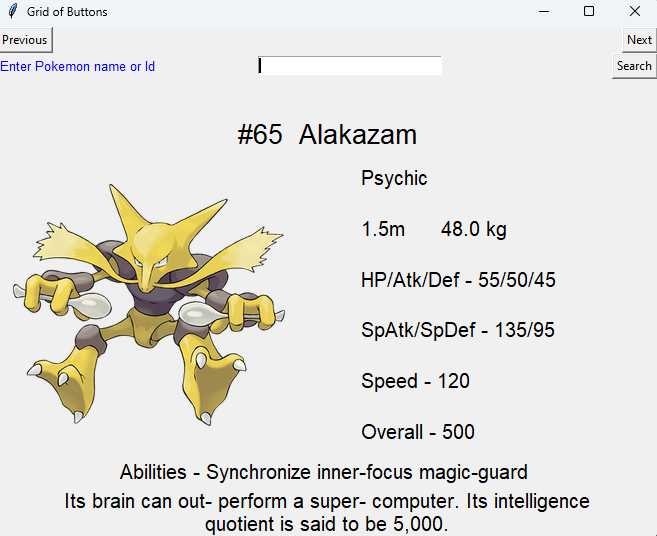

# PokeDex
Contains information of 1025 pokemons with images

---
# Running the program
To run the program, run the folowing command in the folder containing pokedex.py file 
`python.exe .\pokedex.py` 

---
# Using the Pokedex
Next Button - Display the next pokemon in sequence 
Previous Button - Display the previous pokemon in sequence 
Search Button - Enter Pokemon Id/Name in the text box and press Search button.

---
# Screenshot

---
# Credits
Pokemon data set available at 
https://www.kaggle.com/datasets/bhavyadhingra00020/complete-pokemon-dataset-9th-gen-img-tabular
